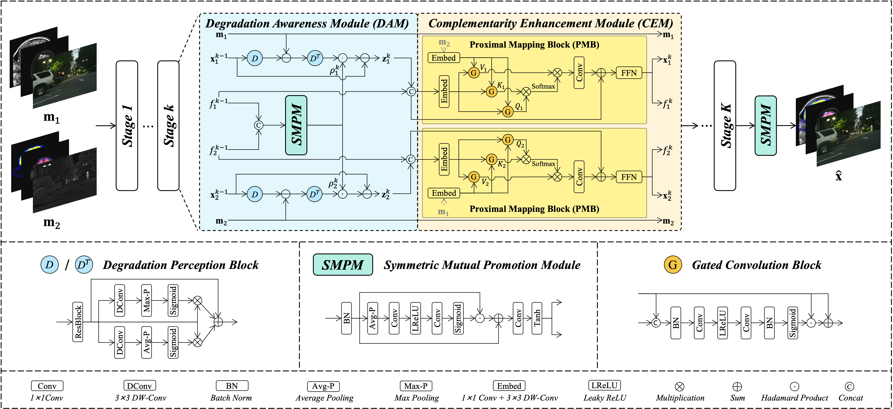
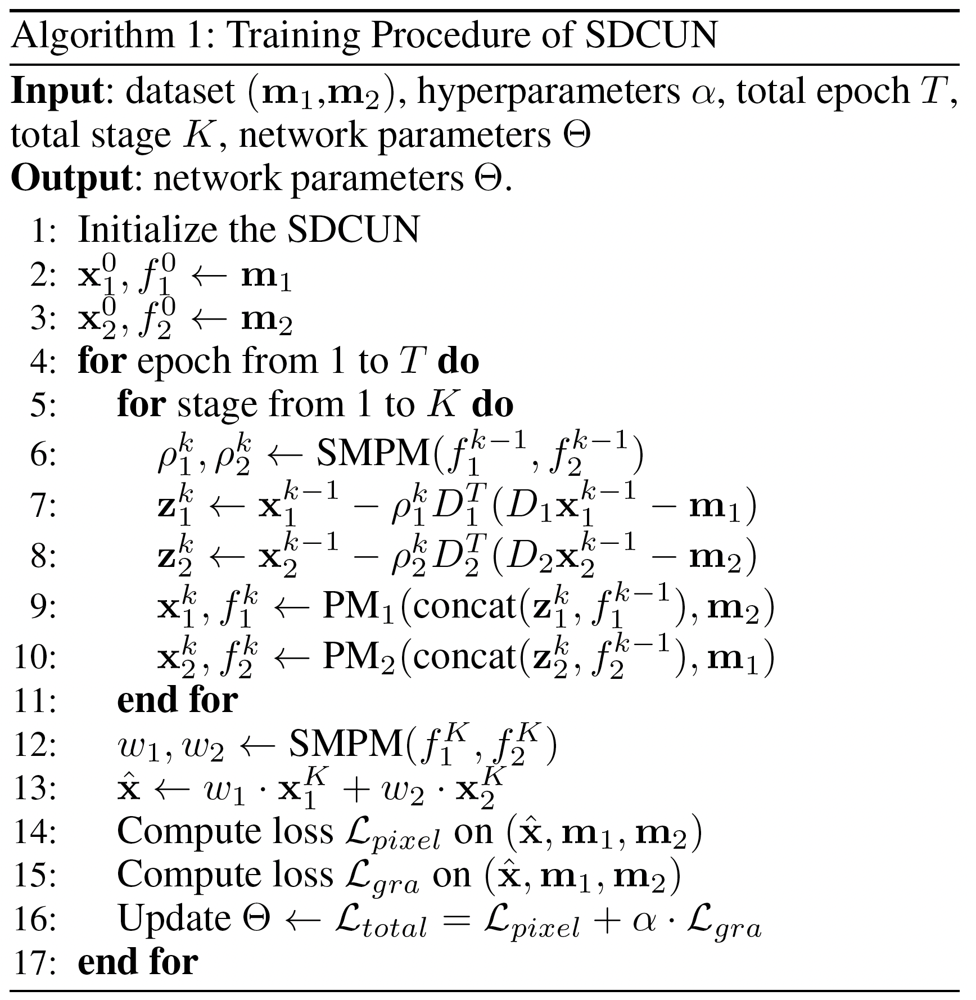
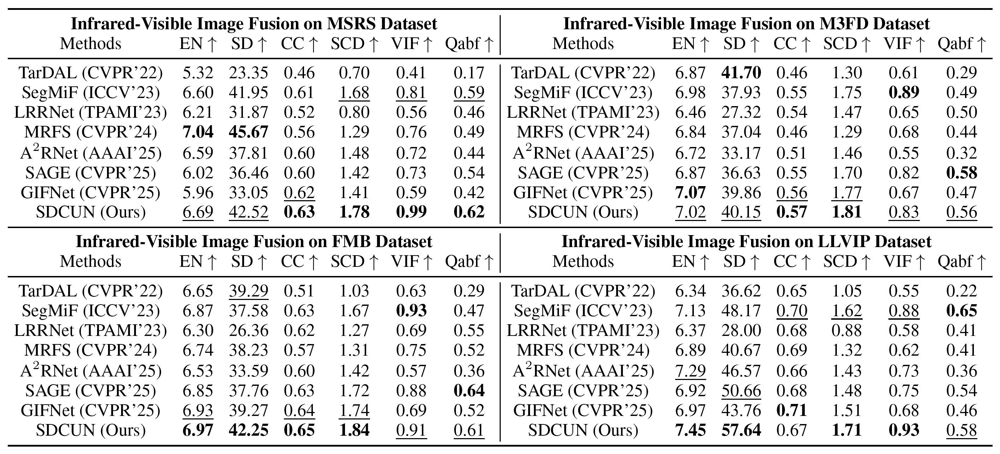
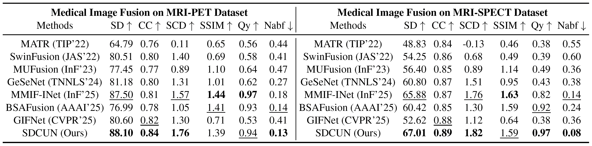
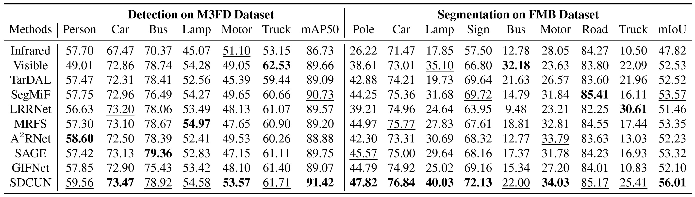

# SDCUN
Code, model and dataset split for our paper: **Towards Interpretable Multi-Modality Image Fusion: A Prior-Free Bayesian Framework**.

[Shihan Ma](https://github.com/op-dog/SDCUN), [Hong Song](https://www.inavilab.com/teachers/sh.html), [Jinfu Li](https://github.com/Bitlijinfu), [Yucong Lin](https://www.inavilab.com/teachers/lyc.html), [Ting Wang](https://openreview.net/profile?id=~Ting_Wang25), [Jianghan Xia](https://github.com/DarkIceField), [Yuanyuan Wang](https://www.inavilab.com/teachers/wyy.html), [Long Shao](https://www.inavilab.com/teachers/sl.html), [Jian Yang](https://www.inavilab.com/teachers/yj.html)

## Update

The code will be available soon~

## Abstract
Multi-Modality Image Fusion (MMIF) aims to reconstruct an informative image from limited observations, which can be formulated as an inverse problem under a Bayesian framework. Due to the ill-posed nature of the inverse problem, proper priors are required to recover the underlying structural characteristics of the fused image. However, current methods mainly depend on hand-crafted, task-specific priors, which limit their generalizability to diverse real-world scenarios. To address this issue, we reformulate MMIF as a prior-free inverse problem based on two basic principles: (1) the fused image should be entirely derived from source modalities, and (2) each source image is treated as an independent degradation of the latent fused image. Building on this reformulation, we propose a Symmetric Degradation-Complementarity Unrolling Network (SDCUN), which implements the prior-free optimization process through a symmetric multi-stage architecture. Each stage comprises a Degradation Awareness Module (DAM) and a Complementarity Enhancement Module (CEM), which respectively model the degradation process of one modality and enhance complementary information from the other. Additionally, we introduce a local gradient-guided pixel-level loss function to adaptively quantify the contribution of each modality. Extensive experiments on multiple infrared-visible and medical datasets demonstrate that our proposed SDCUN consistently outperforms state-of-the-art methods in both visual quality and evaluation metrics across various scenarios, while improving downstream detection and segmentation tasks.

## Usage
### Network Architecture
### Training
### Testing

## SDCUN
### The overall framework of our SDCUN

### Training procedure of SDCUN

### Quantitative comparison of IVF with SOTAs

### Visual comparison of IVF with SOTAs

### Quantitative comparison of MIF with SOTAs

### Visual comparison of MIF with SOTAs

### Performance comparison on downstream applications

